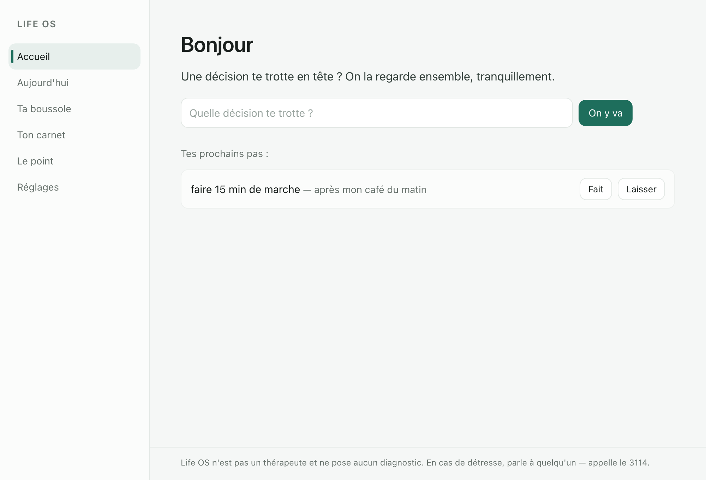
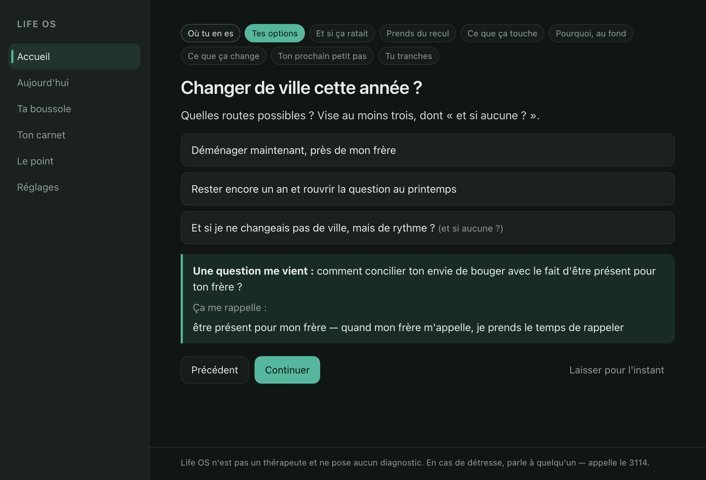
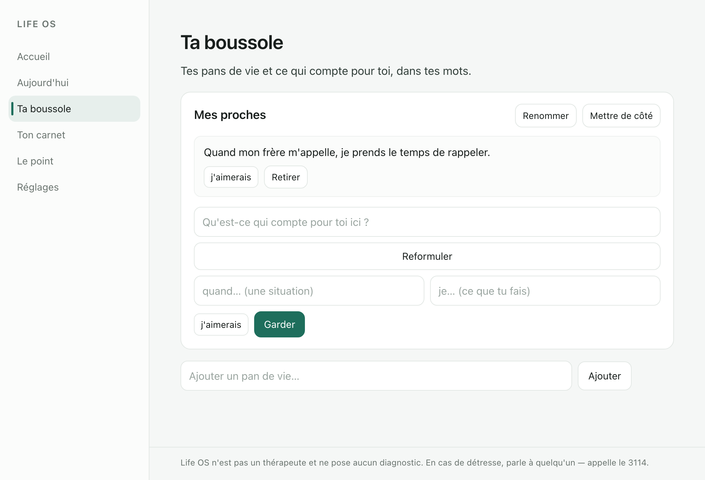
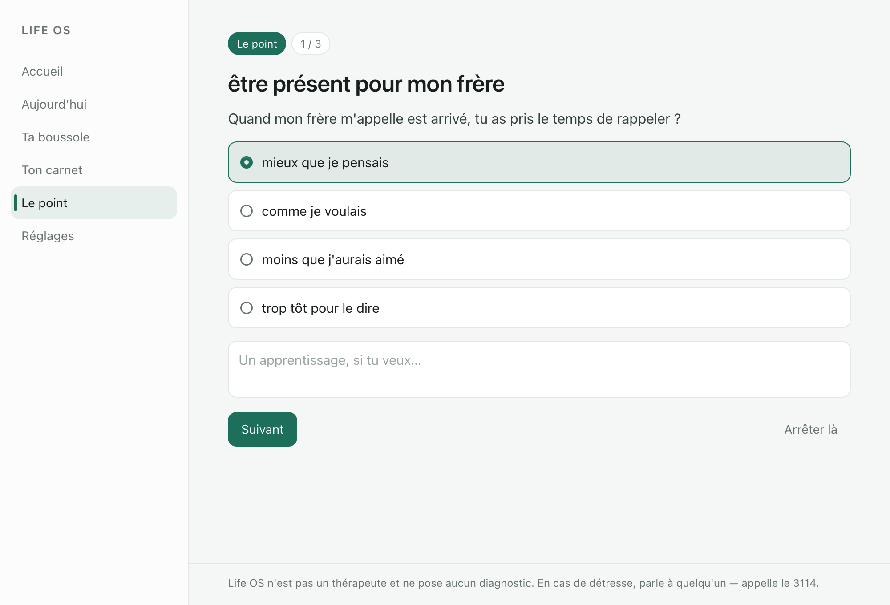
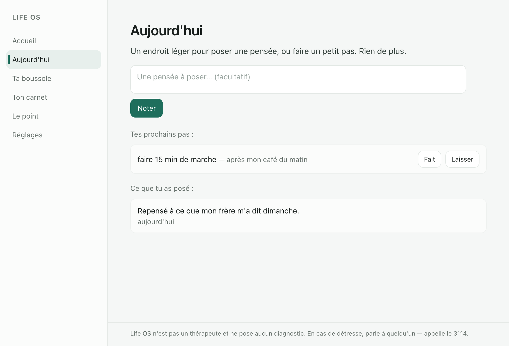
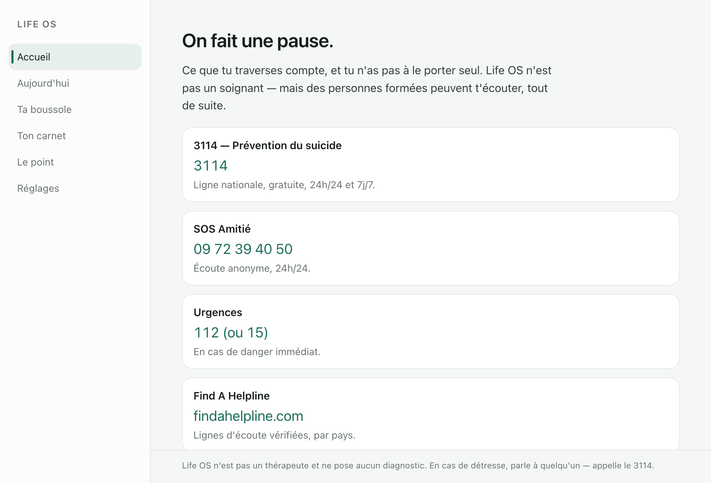

# Life OS

**A local-first life coach that treats your life like a system you version, not a
dashboard you feed.** You write what matters as testable markers, every decision
becomes a change proposal with a delta, and a gentle weekly check-in asks whether
you actually lived it. Warm and jargon-free by default; the Git-like mechanics are
there for those who want them.

Everything stays on your device. The AI runs locally. Nothing phones home.

> Status: the full MVP is built (compass, guided decision, review, memory,
> onboarding, safety) plus a light daily loop and encrypted multi-device sync.
> Pre-1.0, hardened in v0.2.1, dogfooded by its author.

## Why it's different

Most life tools manage *execution* (tasks, cadence) or store *inert values*
(journals, a personal README). Life OS keeps a **living, testable spec of your
life** and measures your decisions and weeks against it — local-first and open
source. The closest neighbours (Complice, Second Me) have neither the
decision-as-delta model nor the compassionate review.

## What it does

- **Compass** — name a few life areas and what matters, in your own words ("when X,
  I Y"). Caps keep it light; the system resists becoming a spreadsheet.
- **Guided decision** — bring a real decision; it's explored (GROW), debiased
  (widen options incl. "what if none?", a pre-mortem, 10/10/10), checked against
  your compass in plain words, and turned into a change with a next small step
  pre-wired to a trigger ("si … alors …").
- **The check-in** — a kind, no-streak weekly replay of your intentions, and a place
  to integrate a confirmed decision into your compass.
- **Memory** — it recalls your relevant past during a new decision (keyword +
  semantic) and raises tension as a gentle question, never a verdict.
- **Today** — a thin daily surface to jot a thought or do a step. A quiet day is
  explicitly fine.
- **Yours** — export everything to Markdown, erase everything, and sync between your
  own devices with an encrypted snapshot. Not a therapist; distress routes to local
  resources on-device.

## Screens

Calm, desktop-native, jargon-free — a cool-neutral paper ground with one deep-teal
accent (the "needle" marks the active surface and the single primary action).

| | |
|---|---|
|  |  |
| **Home** — bring a decision, or do your next step. | **Guided decision** — debiased, compass-aware, memory-aware. |
|  |  |
| **Compass** — what matters, in your words. | **The check-in** — a kind, no-streak weekly replay. |

The daily surface and the on-device distress screen:

| | |
|---|---|
|  |  |
| **Today** — a thin daily loop; a quiet day is fine. | **Safety net** — distress routes to local help, on-device. |

## Stack

Tauri v2 · TypeScript + Vite front · a Rust backend that owns an encrypted SQLite
(SQLCipher) source of truth with FTS5 + sqlite-vec · local AI via Ollama · portable
snapshots encrypted with `age`. The engine mirrors OpenSpec (living specs + change
proposals with deltas); roles are BMAD-style *lenses*, not a multi-agent debate.

## The AI is optional

Life OS runs **fully without any model** — the compass, the guided (debiased)
decision, the check-in, keyword memory, the daily loop, sync, and the safety net all
work offline with nothing installed. A local model only powers the *assists*
(suggesting options, reformulating an intention, semantic recall, the gentle
contradiction question); without one, those degrade softly and everything else is
unaffected. Value without AI is a design rule, not a fallback.

To turn the assists on, install [Ollama](https://ollama.com) (macOS or Windows) and
pull the models — then restart the app:

```bash
ollama pull qwen3:8b            # conversation (or gemma3:12b on 24-32 GB RAM)
ollama pull embeddinggemma      # embeddings for semantic recall (768-dim)
```

Override the chat model with `LIFEOS_MODEL` and the endpoint with `LIFEOS_AI_URL`
(e.g. to reach an Ollama on another machine over Tailscale). Any
**OpenAI-compatible local server** also works — LM Studio, llama.cpp `server`,
or Ollama's own `/v1`:

```bash
LIFEOS_AI_BACKEND=openai LIFEOS_AI_URL=http://127.0.0.1:1234/v1 LIFEOS_MODEL=your-model npm run tauri dev
```

On an OpenAI-compatible backend, structured assists use `response_format`
json_schema (still validated before anything is stored) and the live
reasoning timeline is Ollama-only. Embeddings default to `embeddinggemma`
and can be overridden with `LIFEOS_EMBED_MODEL`.

## Run it

Prerequisites: Node 20+, Rust (stable). Primary target macOS Apple Silicon; Windows
installers are produced by CI (`.github/workflows/build.yml`).

```bash
npm install
cargo install tauri-cli --version "^2"   # first time only
npm run tauri dev
```

The encrypted DB is created on first run under the app data dir; its key is stored
in the OS keychain (Credential Manager on Windows).

### Installing a build (unsigned)

Download the latest build from the
[releases page](https://github.com/guillaume-flambard/life-os/releases): a macOS
`.dmg` (Apple Silicon) and Windows installers (`.msi` / `.exe`) are attached to
each tag. The builds are not code-signed yet, so the OS warns on first open —
this is expected for a pre-1.0 open-source app:

- **macOS**: right-click the app → **Open** → **Open** (once).
- **Windows**: run the `.msi`; on the SmartScreen prompt, **More info → Run anyway**.

> Dev tip: unsigned dev builds get a fresh signature each rebuild, so the keychain
> refuses the previous key. Set a fixed key to keep the same DB across rebuilds:
> `export LIFEOS_DEV_KEY=$(python3 -c "import secrets;print(secrets.token_hex(32))")`.
> Release builds have a stable signature and use the keychain unchanged.

## Layout

- `openspec/` — the artifact backbone (specs + change proposals). Start with
  `openspec/project.md`.
- `src-tauri/` — Rust backend (encrypted DB, migrations, local AI, safety, sync).
- `src/` — TypeScript front (surfaces, typed IPC).
- `docs/` — the source of truth (PRD, blueprint, psychology, resources).

## Privacy & safety

On-device, offline, encrypted at rest, no telemetry. Distress screening is a local
keyword pass that never transmits the text and routes to local crisis resources
(3114, SOS Amitié, 112, Find A Helpline). Not a therapist, no diagnosis.

## Contributing

Read [`CONTRIBUTING.md`](CONTRIBUTING.md) and [`CLA.md`](CLA.md). Security reports:
[`SECURITY.md`](SECURITY.md). Please respect the local-first, no-jargon,
anti-over-systematization, and safety constraints — they are the product.

## License

[AGPL-3.0-or-later](LICENSE). The core app is always AGPL; your data and insights
are never part of any licensing arrangement.
